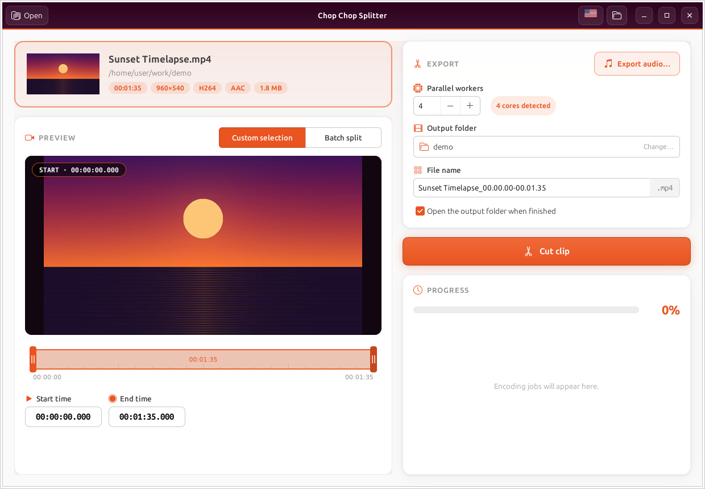
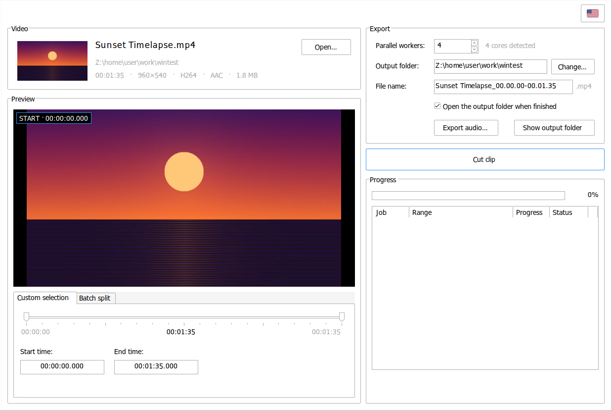

<p align="center">
  
</p>

<h1 align="center">Chop Chop Splitter</h1>

<p align="center">
  Cut a clip out of a video, or split a whole video into parts, fast.<br>
  Frame-accurate, almost lossless, with audio export. For Ubuntu and Windows.
</p>

<p align="center">
  <a href="https://github.com/NullMagic2/chop-chop/releases/latest"><b>Download</b></a> ·
  <a href="#features">Features</a> ·
  <a href="#install">Install</a> ·
  <a href="#build-from-source">Build</a>
</p>



Chop Chop Splitter is a small, focused video cutter. Open a video, drag the two handles on the
timeline (or type exact times), and press **Cut clip**. To split a long recording into
pieces, switch to **Batch split** and choose "every 5 minutes" or "4 equal parts". Behind
the scenes [FFmpeg](https://ffmpeg.org) re-encodes only the few frames between each cut and
the nearest keyframe and copies everything else untouched, so a cut lands exactly on the
frame you chose, keeps the original quality, and takes about as long as copying the file.

It is written in Rust. On Ubuntu it is a GTK 3 app with Ubuntu's Yaru icons. On Windows it
is a native Win32 app built with [windows-rs](https://github.com/microsoft/windows-rs). Both
use the same cutting engine and translations.

## Features

- **Two modes**
  - *Custom selection*: cut one clip between a start and an end time.
  - *Batch split*: cut the whole video into parts, either every N minutes/seconds or into N equal parts. Several parts are cut at once.
- **Precise start/end**: drag the handles on the timeline, or type `HH:MM:SS.mmm`, `MM:SS` or plain seconds. The selection follows as you type.
- **Live preview**: a large frame preview of the start or end point that updates as you move, plus a thumbnail of the file.
- **Frame-accurate, almost lossless cutting**: only the frames from each cut to the nearest keyframe inside the range are re-encoded, with the source's own codec (H.264 or HEVC), profile and pixel format. The video between those keyframes and the audio are copied, and the pieces are joined without re-encoding, so no frame is duplicated or dropped. Videos that can't be cut this way (other codecs, open-GOP streams) are re-encoded to H.264 instead, on the GPU when there is one (NVIDIA NVENC, AMD AMF, Intel Quick Sync, or VA-API on Linux).
- **Export audio** as **WAV, MP3, OGG (Vorbis), FLAC, M4A (AAC) or OPUS**: pick the format in the save dialog. In Batch split you get one audio file per part.
- **Per-job progress** with an ETA, Cancel (temporary files are cleaned up), overwrite confirmation, an editable file name filled in from the clip range, drag & drop, and Ctrl+O.
- **Four languages**: English, Português, Español and Ελληνικά. Switch with the flag button; the choice is remembered, and on first launch the system language is used.


## Windows

The Windows build is a native Win32 application with the same layout as the Ubuntu version.
It uses the standard Windows controls (group boxes, tabs, spin boxes, a progress bar and a
list view), the system font and theme, and the Windows file dialogs. It supports
per-monitor DPI scaling.



## Install

Get the files from the [latest release](https://github.com/NullMagic2/chop-chop/releases/latest).

### Ubuntu 24.04 / 26.04

```bash
sudo apt install ./chop-chop_1.8.0_amd64.deb
```

This also installs `ffmpeg` if you don't have it. Launch **Chop Chop Splitter** from the app
grid, or run `chop-chop [file]`. It replaces the older `chopchop` and `video-splitter`
packages.

### Windows 10 / 11 (64-bit)

Run `chop-chop-1.8.0-windows-x64-setup.exe`. FFmpeg is included, so there is nothing else
to install.

## Build from source

### Ubuntu

```bash
sudo apt install cargo libgtk-3-dev dpkg-dev ffmpeg
cargo build --release                 # binary: target/release/chop-chop
./packaging/build-deb.sh              # .deb:   target/deb/
```

### Windows

With [Rust](https://rustup.rs) (MSVC toolchain) installed:

```powershell
cd windows
cargo build --release                 # binary: windows\target\release\chop-chop.exe
```

`chop-chop.exe` looks for `ffmpeg.exe` and `ffprobe.exe` next to itself, then on the
`PATH`. To build the installer, install [NSIS](https://nsis.sourceforge.io) and run:

```powershell
cd windows\installer
makensis -DVERSION=1.8.0 -DAPPDIR=..\target\release -DFFMPEG=C:\path\to\ffmpeg\bin chop-chop.nsi
```

That setup program is 32-bit (the app it installs is 64-bit). For a 64-bit setup program, add
`-XTarget amd64-unicode` before `chop-chop.nsi`; this needs an NSIS built from source with
`TARGET_ARCH=amd64`, because the official NSIS release only includes 32-bit stubs.

You can also cross-compile from Linux with `rustup target add x86_64-pc-windows-gnu` and
`mingw-w64`. Then build with `cargo build --release --target x86_64-pc-windows-gnu` in
`windows/`.

### Releases

Pushing a tag such as `v1.8.0`, or running the [Release workflow](.github/workflows/release.yml)
by hand with that tag name, builds the `.deb` on Ubuntu 24.04 and the Windows installer and
publishes both to a GitHub release.

## Project layout

```
src/
  main.rs        GTK 3 user interface (Ubuntu)
  splitter.rs    FFmpeg engine: probing, thumbnails, smart cutting (shared)
  i18n.rs        English / Português / Español / Ελληνικά strings (shared)
windows/
  src/           Native Win32 user interface (windows-rs)
  installer/     NSIS installer script
data/            Icons (Yaru), app icon and GTK stylesheet
packaging/       .deb build script and desktop entry
```

## License

Chop Chop Splitter is released under the [MIT License](LICENSE).

The icons in `data/icons/` come from [Yaru](https://github.com/ubuntu/yaru) by the Ubuntu
community and are licensed under CC BY-SA 4.0 (`data/icons/LICENSE_CCBYSA`). The app icon in
`data/appicon/` is original artwork made for this project. The Windows installer includes an
[FFmpeg](https://ffmpeg.org) build licensed under the GPL; its license is installed alongside
it.
